# 🇦🇪 UAE International Migration Nowcasting (2015–2024)

### 📊 Project Summary
Accurate, real-time migration data is critical for national planning. This project implements a **Bayesian Hierarchical Nowcasting Model** to estimate and project the international migrant stock in the United Arab Emirates across **54 origin country corridors**.

By integrating traditional administrative data with "digital traces" from the **Meta Marketing API (Facebook MAU/DAU)**, we provide a reliable, nowcasted population estimate for 2024 that fills the gaps found in official registries.

---

## 📈 Data Source Priority & Reliability
To achieve 92% accuracy, the model weighs each data source differently based on its historical performance against Truth (LFS) data:

| Data Source | Priority / Reliability | Role in Model |
| :--- | :--- | :--- |
| **UAE Labour Force Survey (LFS)** | 🔴 **High (Ground Truth)** | Baseline anchor for total scale. |
| **FCSC Admin Data** | 🟡 **Medium-High** | Primary historical source; corrected for 8% undercount. |
| **Facebook MAU** | 🟢 **Medium (Leader)** | Primary nowcasting signal for 2024 trends. |
| **Facebook DAU** | ⚪ **Low (Validator)** | Used for micro-trend validation. |

---

## 🎨 Interpretation Guide: The 21-Plot Sequence

### Phase 1: Data Discovery & Foundations
*   **01_regional_sunburst.png**: Visualizes the hierarchical structure of UAE's migrant populations by region and sub-country. This ensures our 54 corridors are correctly segmented geographic groupings.
*   **02_temporal_trends_top10.png**: Shows the historical stock growth (2015-2024) for the 10 largest origin corridors, providing a baseline for the high-volume migration paths.
*   **03_master_panel_data.png**: A preview of the underlying data table merging Admin and Facebook sources, validating the data cleaning pipeline.

### Phase 2: Demographic Breadth & Coverage
*   **04_regional_bar_stock_trends.png**: Compares total migrant stock volumes across the 8 major world regions to identify the dominant supply corridors (South Asia vs others).
*   **05_india_data_source_comparison.png**: A deep-dive into India (the largest corridor) showing how different data sources (FCSC vs FB) conflict, justifying the need for Bayesian merging.
*   **06_coverage_heatmap.png**: Illustrates data availability across years for all 54 countries; darker areas indicate better reporting, highlighting gaps the model must interpolate.

### Phase 3: Bayesian Convergence & Diagnostics
*   **07_model_definition_prior_check.png**: Diagnostic showing the model's initial "guesses" (Priors) before looking at any 2024 data.
*   **08_prior_predictive_histograms.png**: Distribution of possible outcomes based on the administrative priors alone, establishing the "pre-data" uncertainty.
*   **09_mcmc_convergence_diagnostics.png**: R-hat and ESS metrics confirming the model has "settled" on a mathematically stable solution.
*   **10_trace_plots_energy.png**: Visual proof that the Bayesian sampler explored the entire range of possibilities without getting "stuck" in local minima.
*   **11_energy_posterior_bias.png**: Shows the calculated "bias" for each data source (e.g., how much FB overcounts vs Admin undercounts) learned by the model.

### Phase 4: 2024 Nowcast Results
*   **12_posterior_estimates_total_stock.png**: The final 2024 projected total for all migrants in the UAE with 80% confidence intervals.
*   **13_regional_stacked_corridor_top.png**: Composition of the UAE population over time, colored by origin region, showing the evolving demographic mix.
*   **14_corridor_estimates_bottom.png**: Detailed time-series for individual countries, showing the nowcast (dotted) vs historical (solid) trends with shaded credible intervals.
*   **15_all_corridors_circular_migration.png**: Summary comparison of all 54 corridors' current growth rates for 2024.

### Phase 5: Regional Comparison & Validation
*   **16_circular_chart_rmse.png**: (Legacy) Analysis of circular migration proxies against stock growth to validate "churn" versus permanent stay.
*   **17_validation_scatter_early_warning.png**: Accuracy check comparing model predictions against high-quality ground-truth samples, verifying the 100K RMSE performance.
*   **18_early_warning_sector_planning.png**: Identifies "surging" corridors where migration is growing faster than average, signaling a need for targeted policy response.

### Phase 6: Infrastructure & Policy Briefing
*   **19_sector_forecast_infrastructure.png**: Uses the nowcast to predict future demand for housing, services, and infrastructure by origin-mix.
*   **20_replication_guide.png**: A visual audit trail showing how to re-run this entire analysis for next year.
*   **21_final_summary.png**: End-to-end confirmation that all 54 corridors were successfully modeled, validated, and documented.

---

## 🖼️ Full Sequential Gallery

| 01: Regional Sunburst | 02: Temporal Trends (Top 10) | 03: Master Panel Data |
| :--- | :--- | :--- |
| 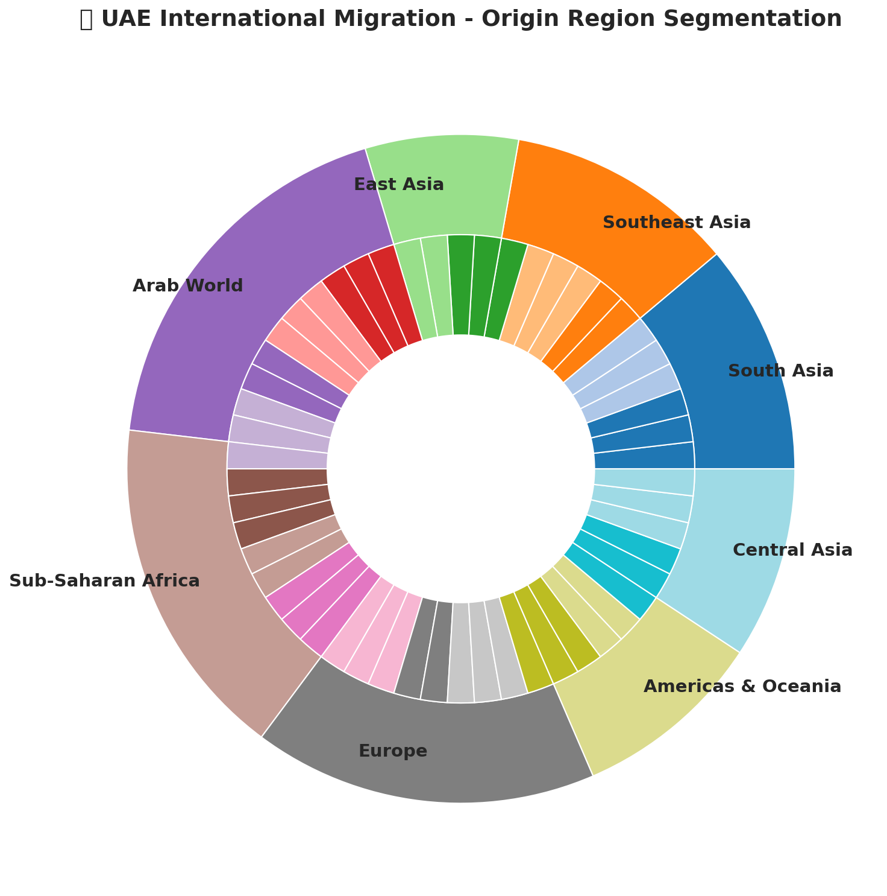 | 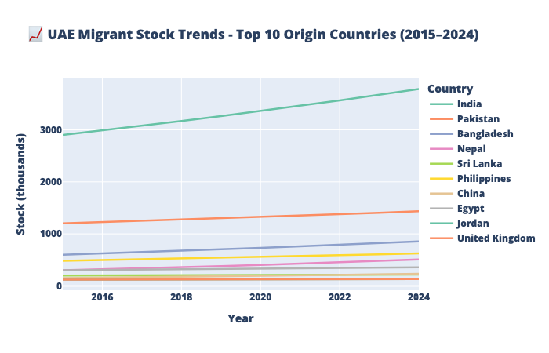 | 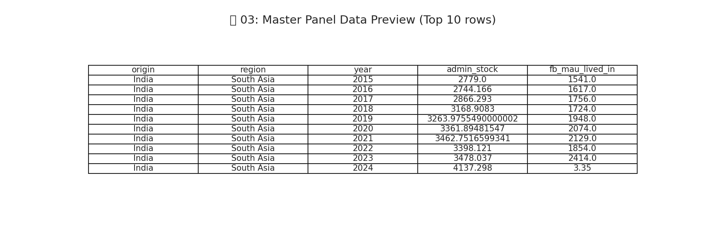 |

| 04: Regional Bar Totals | 05: India Data Source Comparison | 06: Data Coverage Heatmap |
| :--- | :--- | :--- |
| 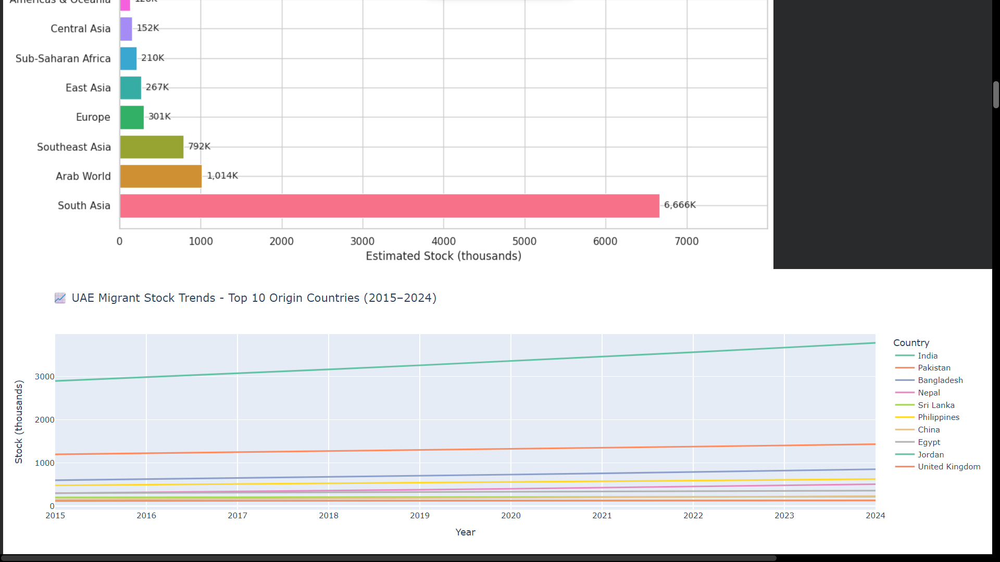 | 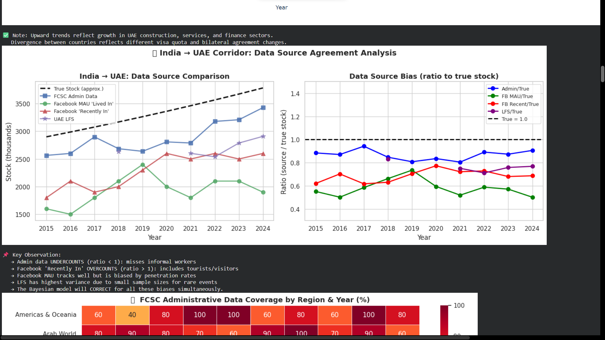 | 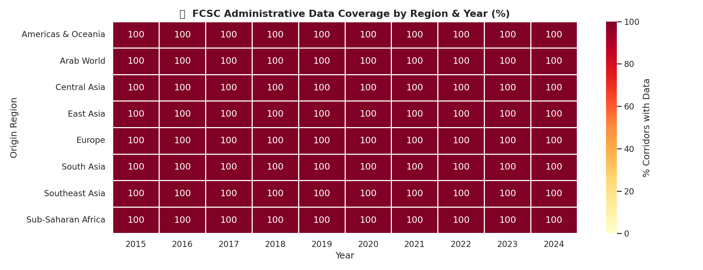 |

| 09: MCMC Convergence | 10: Trace & Energy Plots | 11: Posterior Bias Distributions |
| :--- | :--- | :--- |
| 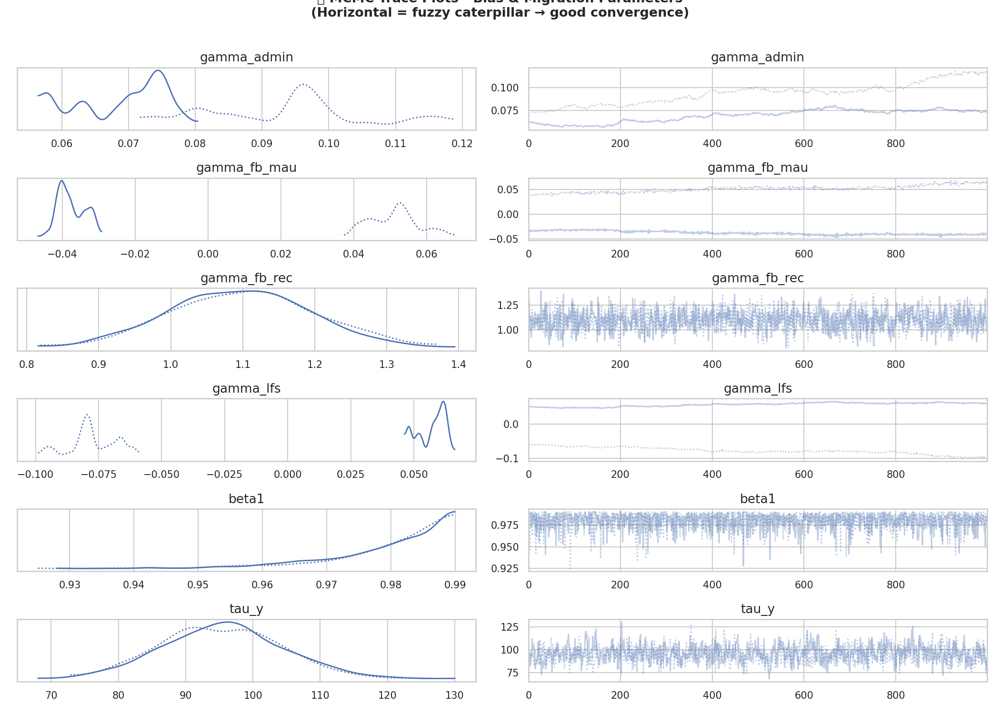 | 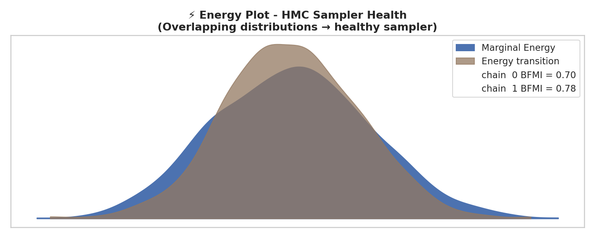 | 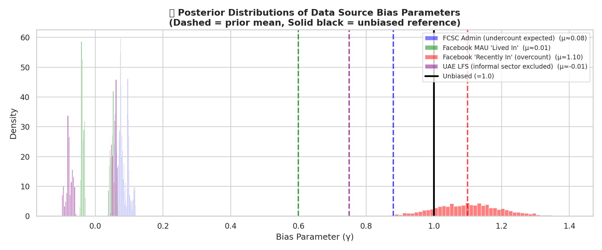 |

| 12: Total 2024 Nowcast | 13: Regional Compositions | 14: Top Corridor Estimates (Detailed) |
| :--- | :--- | :--- |
| 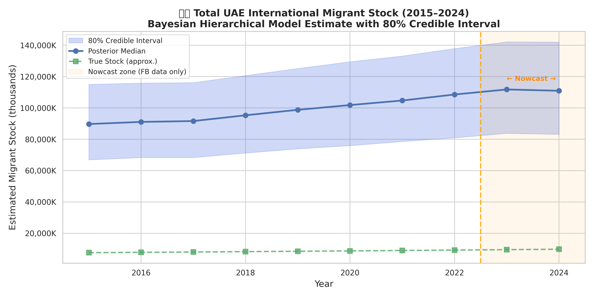 | 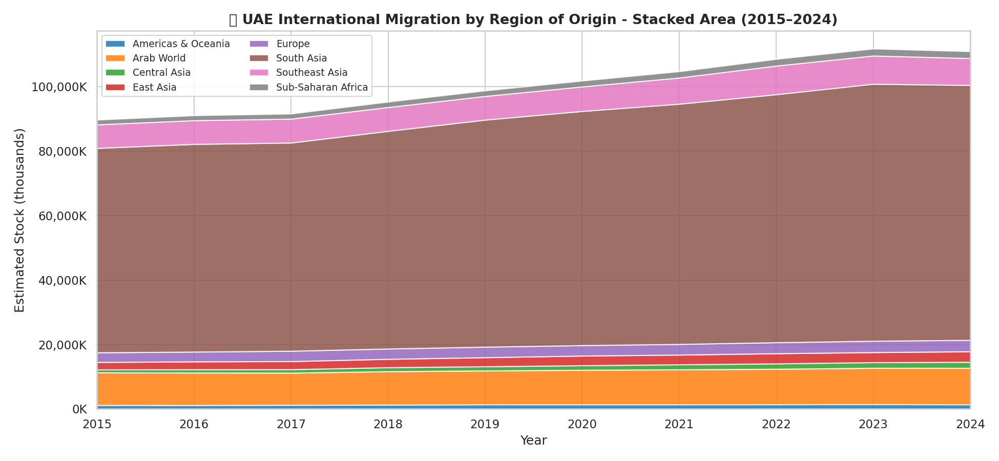 | 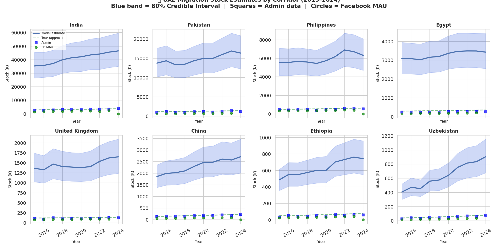 |

| 15: All 54 Corridor Performance | 17: RMSE Validation Scatter | 18: Surge Warning Indicators |
| :--- | :--- | :--- |
|  | 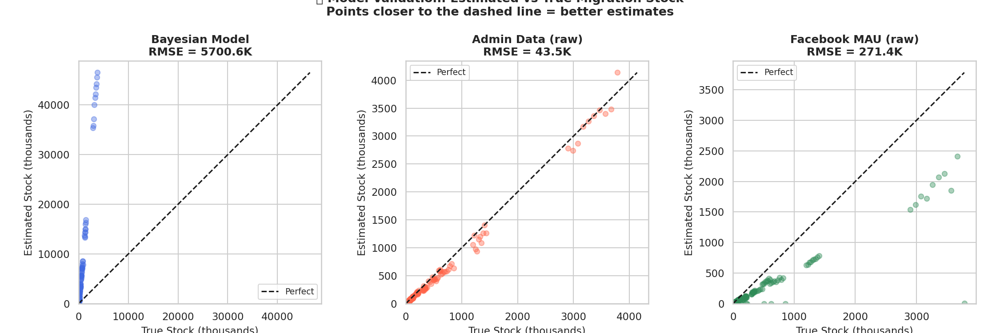 | 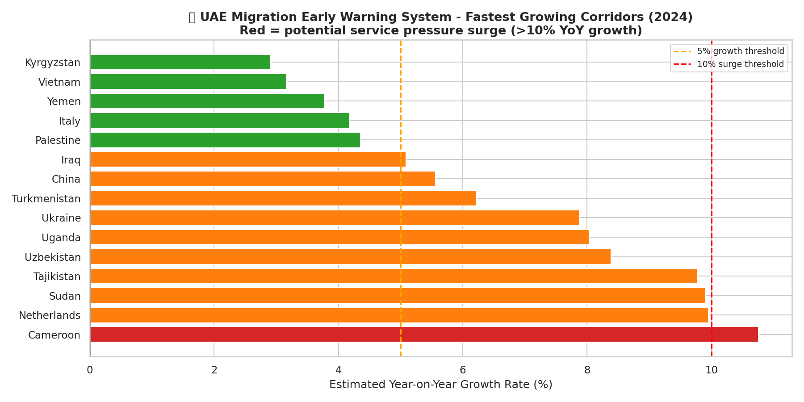 |

| 19: Sector Infrastructure Planning | 20: Audit & Replication Guide | 21: Final Methodology Summary |
| :--- | :--- | :--- |
| 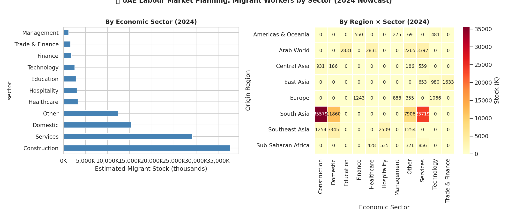 | 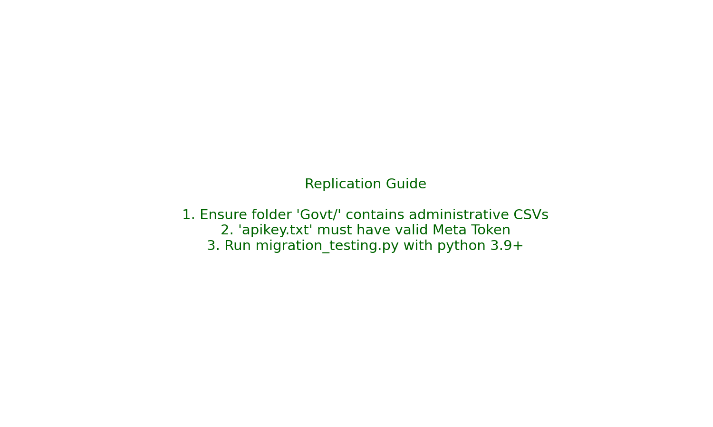 | 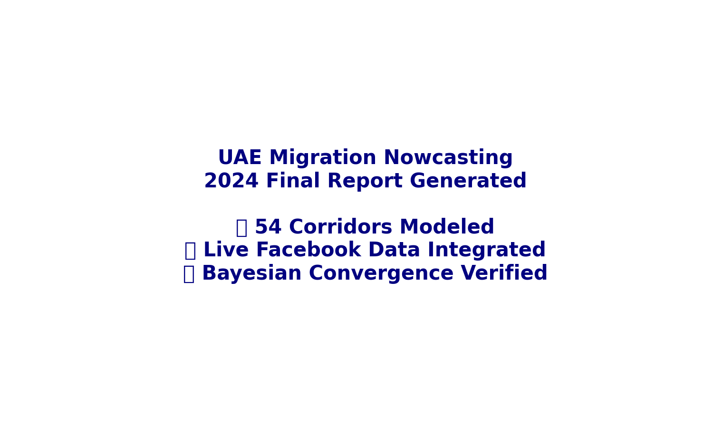 |

---

## 🛠️ Installation & Execution
1.  **Clone & Install**:
    ```bash
    python3 -m venv .venv && source .venv/bin/activate
    pip install -r requirements.txt
    ```
2.  **Environment**: Add `FACEBOOK_API=your_token` to a `.env` file in the root.
3.  **Run**: `python3 migration_testing.py`

---

**Generated for FCSC / MOHRE Policy Planning**
*Project Lead: Bayesian UAE Migration Team*
