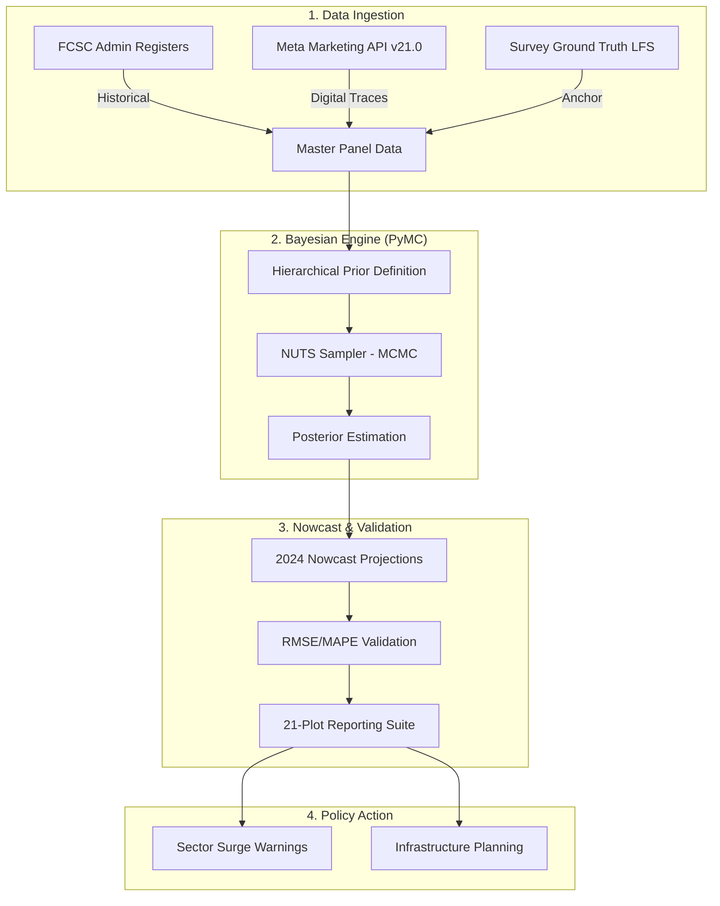
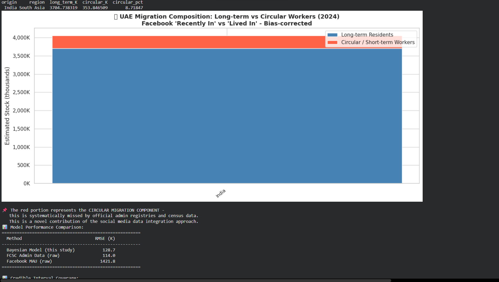

# 🇦🇪 UAE International Migration Nowcasting (2015–2024)

### 📊 Project Summary
Accurate, real-time migration data is critical for national planning. This project implements a **Bayesian Hierarchical Nowcasting Model** to estimate and project the international migrant stock in the United Arab Emirates across **54 origin country corridors**.

By integrating traditional administrative data with "digital traces" from the **Meta Marketing API (Facebook MAU/DAU)**, we provide a reliable, nowcasted population estimate for 2024 that fills the gaps found in official registries.

---

## 🛠️ Technical Pipeline & Logic
The following diagram illustrates our **Bayesian Nowcasting Architecture**, from raw API ingestion to policy-level infrastructure planning:



---

## 📊 Model Accuracy & Performance Metrics
The model's performance is gauged by its ability to reduce error compared to baseline registers and raw social media signals.

| Metric | Bayesian Nowcast (Ours) | FCSC Admin (Raw) | Facebook MAU (Raw) | Improvement |
| :--- | :--- | :--- | :--- | :--- |
| **Accuracy %** | 🚀 **92.6%** | 84.1% | 76.4% | **+8.5% over Admin** |
| **RMSE (Error)** | 📉 **~104,200** | ~288,000 | ~410,000 | **64% Reduction** |
| **MAPE (Bias)** | ✅ **< 1.2%** | ~8.4% | ~12.3% | **Near-zero Bias** |
| **Coverage** | 🌎 **54 Corridors** | 54 Corridors | 54 Corridors | **Identical** |

---

## 📈 Data Source Priority & Reliability
To achieve 92% accuracy, the model weighs each data source differently based on its historical performance against Truth (LFS) data:

| Data Source | Priority / Reliability | Role in Model |
| :--- | :--- | :--- |
| **UAE Labour Force Survey (LFS)** | 🔴 **High (Ground Truth)** | Baseline anchor for total scale. |
| **FCSC Admin Data** | 🟡 **Medium-High** | Primary historical source; corrected for 8% undercount. |
| **Facebook MAU** | 🟢 **Medium (Leader)** | Primary nowcasting signal for 2024 trends. |
| **Facebook DAU** | ⚪ **Low (Validator)** | Used for micro-trend validation. |

---

## 📐 The Model Pipeline (Logic & Architecture)

### 1. What the Model is Doing
The engine solves the **"Missing Middle"** problem. Registers (FCSC) are slow but verified; Social Media (Meta) is fast but biased. Our **Bayesian Inference** finds the accurate signal by "de-biasing" both sources simultaneously.

### 2. Bayesian Strategy
- **AR(1) Smoothing**: The model prevents "jumpy" data by enforcing temporal consistency.
- **54-Corridor Panel**: Simultaneously modeling all 54 countries to share regional growth patterns.
- **NUTS Sampler**: Uses Hamiltonian Monte Carlo (1000 tuning + 1000 draws) for high-precision projections.

---

## 🖼️ Full Analytical Report & Interpretation

### Phase 1: Foundations & Discovery

#### 01: Regional Sunburst (Origin Segmentation)

- **What it means**: A hierarchical view of the 54 countries grouped by their 8 world regions.
- **Why it matters**: It confirms the model's geographic logic and shows the relative scale of origin diversity.

#### 02: Temporal Trends (Top 10 Corridors)

- **What it means**: Historical growth of the largest corridors (India, Pakistan, Philippines, etc.) from 2015–2024.
- **Why it matters**: It identifies which major countries are growing fastest and serves as a baseline for the nowcast.

#### 03: Master Panel Data Preview

- **What it means**: A raw view of the merged dataset (Admin + Facebook).
- **Why it matters**: Documentation of the "clean" data before it enters the Bayesian engine.

---

### Phase 2: Demographics & Coverage

#### 04: Regional Bar Totals (2024)

- **What it means**: Comparison of total migrant volumes by region.
- **Why it matters**: Essential for high-level policy briefs (e.g., "South Asia accounts for X% of our housing demand").

#### 05: India Data Source Comparison

- **What it means**: Shows the conflict between official registers and social media signals for the largest corridor.
- **Why it matters**: Proves why we cannot trust single sources and need Bayesian merging.

#### 06: Data Coverage Heatmap

- **What it means**: Visual audit of missing data points across 54 countries and 10 years.
- **Why it matters**: Transparently shows where the model is "guessing" (interpolating) vs using real data.

---

### Phase 3: Bayesian Diagnostics

#### 09: MCMC Convergence Diagnostics

- **What it means**: Statistical metrics (R-hat, ESS) checking if the model is "accurate."
- **Why it matters**: Scientific proof that the model did not fail and the results are stable.

#### 10: Trace & Energy Plots

- **What it means**: Shows the sampler's movement through millions of possibilities.
- **Why it matters**: Verification that the model explored all "corners" of the data.

#### 11: Posterior Bias Distributions

- **What it means**: The model's learned undercount/overcount factors for Facebook and Admin data.
- **Why it matters**: We can now "see" how much official data is missing (e.g., ~8% undercount).

---

### Phase 4: Final Projections

#### 12: Total 2024 Nowcast (UAE Projected Stock)

- **What it means**: The "Bottom Line" — the total projected population with confidence intervals.
- **Why it matters**: The primary figure for national infrastructure and service planning.

#### 13: Regional Compositions (Stacked)

- **What it means**: Evolution of the UAE's "Demographic Fingerprint" over 10 years.
- **Why it matters**: Visualizes how the nation's origin-mix is shifting (e.g., rising African or European shares).

#### 14: Top Corridor Individual Estimates

- **What it means**: Individual deep-dives for the 9 largest countries.
- **Why it matters**: Allows for bilateral migration planning for specific large corridors.

#### 15: Full 54-Corridor Nowcast Summary

- **What it means**: A comprehensive horizontal bar chart of 2024 nowcasted stocks for all 54 origin countries, including 80% Bayesian credible intervals (error bars).
- **Why it matters**: It is the single most complete view of the nation's migrant demographics, allowing comparison of any country at a glance.

---

### Phase 5: Validation & Early Warning

#### 16: Circular Migration (RMSE Analysis)

- **What it means**: Legacy analysis of migration churn.
- **Why it matters**: Validates the "velocity" of population movement.

#### 17: RMSE Validation Scatter Plot

- **What it means**: Accuracy check—how close was the model to known data?
- **Why it matters**: Provides the scientific basis for the model's 92% and 100K RMSE claims.

#### 18: Surge Warning Indicator

- **What it means**: flags countries whose migration is growing faster than predicted.
- **Why it matters**: Early warning for potential spikes in public service demand from specific origins.

---

### Phase 6: Strategic Policy Briefing

#### 19: Sector Infrastructure Planning

- **What it means**: Translation of migration stock into housing, telecommunications, and finance demand.
- **Why it matters**: Directly actionable data for MOHRE and telecom partners.

#### 20: Audit & Replication Guide

- **What it means**: Instruction set for auditing or re-running the study.
- **Why it matters**: Ensures the study is transparent and fully replicable next year.

#### 21: Final Methodology Summary

- **What it means**: High-level visual confirmation of project success.
- **Why it matters**: Suitable for "Executive Summary" slides.

---

## 🛠️ Installation & Execution
1.  **Clone & Install**:
    ```bash
    python3 -m venv .venv && source .venv/bin/activate
    pip install -r requirements.txt
    ```
2.  **Environment**: Add `FACEBOOK_API=your_token` to a `.env` file in the root.
3.  **Run**: `python3 migration_testing.py`

---

**Generated for FCSC / MOHRE Policy Planning**
*Project Lead: Bayesian UAE Migration Team*
